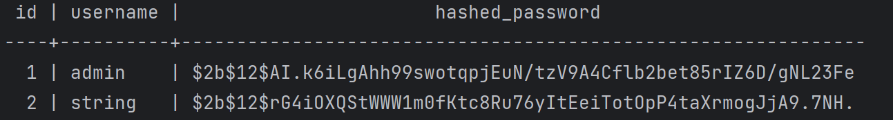
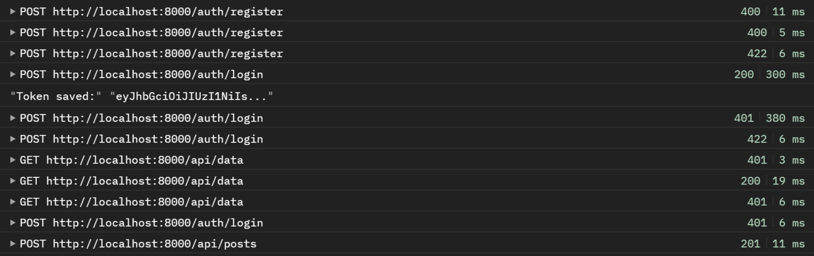
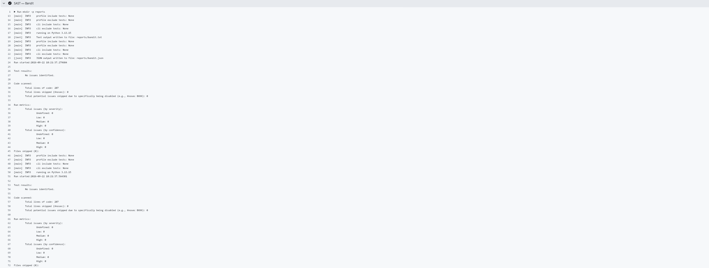
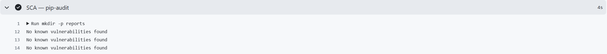

# LABORATORY WORK 1

## Стек

- Язык - Python 3.13

- Менеджер пакетов - uv 

- Веб-фреймворк - FastAPI

- ORM - SQLAlchemy 

- БД - PostgreSQL 17

- Аутентификация - JWT (HS256)

## Эндпоинты API

### 1. Health-check
**GET /health**

### 2. Регистрация нового пользователя
**POST /auth/register**

` {
     "username": "string",
     "password": "string"
   }
`
### 3. Логин, возвращает JWT
**POST /auth/login** 

` {
     "username": "admin",
     "password": "admin123"
   }`

### 4. Список пользователей
**GET /api/data**

### 5. Создание поста
**POST /api/posts**

`   {
     "title": "Заголовок",
     "content": "Содержимое"
   }`

### 6. Список постов
**GET /api/posts**

---

## Реализованные меры защиты

### 1. Защита от SQL-инъекций (SQLi)

Все обращения к базе данных выполняются через **SQLAlchemy ORM**
с параметризацией. Прямая конкатенация SQL-строк в проекте отсутствует.

**Проверка.** Запрос с классической инъекцией:

### 2. Защита от XSS

Все входные строковые поля экранируются через `html.escape()`
в Pydantic-валидаторах (`src/schemas.py`). Экранирование происходит **на этапе
валидации** — до сохранения в БД и до выдачи в ответах API.

    import html

    def sanitize(value: str) -> str:
        """Экранирование HTML — защита от XSS."""
        return html.escape(value, quote=True)

Применяется к:
- `RegisterRequest.username`
- `PostCreate.title`
- `PostCreate.content`

**Проверка.** Запрос с XSS-пейлоадом:

### 3. Защита от Broken Authentication

Реализована в три слоя.

**3.1. Хэширование паролей (bcrypt).**

В БД хранится только bcrypt-хэш с автосолью (`src/security.py`):

    import bcrypt

    def hash_password(password: str) -> str:
        return bcrypt.hashpw(password.encode("utf-8"), bcrypt.gensalt()).decode("utf-8")

    def verify_password(plain: str, hashed: str) -> bool:
        return bcrypt.checkpw(plain.encode("utf-8"), hashed.encode("utf-8"))

**3.2. JWT при логине.**

`POST /auth/login` возвращает подписанный HS256-токен с полями
`sub` (username), `iat`, `exp` (60 минут):

    def create_access_token(subject: str) -> str:
        now = datetime.now(timezone.utc)
        payload = {
            "sub": subject,
            "iat": now,
            "exp": now + timedelta(minutes=ACCESS_TOKEN_EXPIRE_MINUTES),
        }
        return jwt.encode(payload, SECRET_KEY, algorithm=ALGORITHM)

`SECRET_KEY` — минимум 32 байта.
Проверка длины выполняется при старте приложения (`src/config.py`).

**3.3. Middleware проверки JWT.**

Функция `get_current_user` (`src/deps.py`) подключена ко всем защищённым
эндпоинтам через `Depends(...)`:

    def get_current_user(
        token: str = Depends(oauth2_scheme),
        db: Session = Depends(get_db),
    ) -> User:
        try:
            payload = decode_token(token)
            username = payload.get("sub")
        except jwt.PyJWTError:
            raise HTTPException(401, "Could not validate credentials")
        user = db.query(User).filter(User.username == username).first()
        if not user:
            raise HTTPException(401, "Could not validate credentials")
        return user

Проверяет: подпись токена, срок действия, наличие пользователя в БД.
---

## CI/CD

Конфигурация: [`.github/workflows/ci.yml`](.github/workflows/ci.yml)
Запускается автоматически при:
- `push` в ветку main
- `pull_request` в ветку main

### Ручное тестирование через Postman

Регистрация:  201 (успех), 400 (дубликат), 422 (короткий пароль)

Логин:        200 (успех), 401 (неверный пароль), 422 (нет поля), 401 (SQLi)

/api/data:    401 (без токена), 200 (с токеном), 401 (фейковый токен)

/api/posts:   201 (XSS экранирован)

### Pipeline

SAST - Bandit (uv run bandit -r src -ll) 

SCA - pip-audit (uv run pip-audit)

Последний pipeline:
https://github.com/yusupovalisaa/ib_lr1/actions/runs/35766566044/job/106877479650

